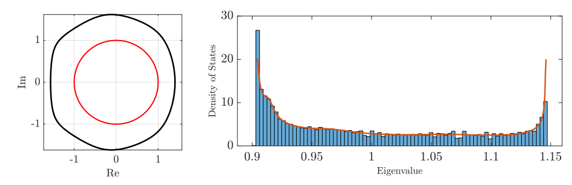
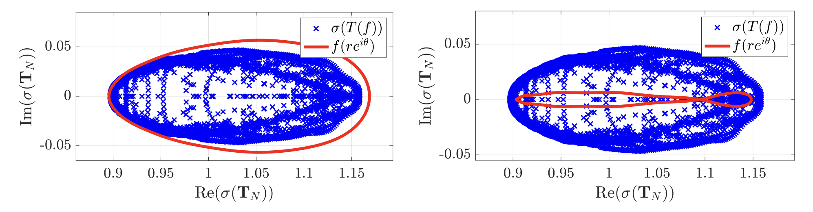
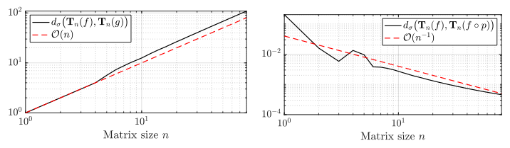
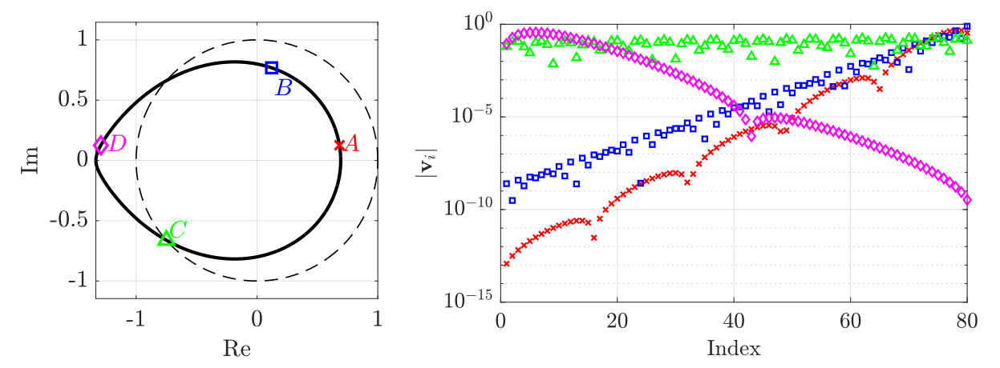

<h1 align="center">Open Limit of <i>m</i>-Banded Toeplitz Operators</h1>

  <b>Y. DE BRUIJN</b> and <b>E. O. HILTUNEN</b> 
  <i>University of Oslo</i> 

  

**Abstract:** We provide the complete computational framework supporting the theoretical results in [1].

  Last updated: January 26, 2026

  
## I.1 Spectrum of Open Limit

This animation illustrates that the open limit is given by the intersection of spectra of Toeplitz operators evaluated on the *r*-scaled torus:

$$\lim_{n\to\infty} \sigma\left(\mathbf{T}_n(f_m)\right) = \bigcap_{r>0} \sigma\left(\mathbf{T}\left(f_m(r\mathbb{T})\right)\right) = \left\lbrace \lambda \in \mathbb{C} ~:~ |z_{m}(\lambda)| = |z_{m+1}(\lambda)| \right\rbrace$$

**Collapsed symbol Movie** (`CollapseSymbolMovie.m`)

    <em>Figure 1: Open limitis real valued. Computation performed for m=3, p = 4.5 and q = 6.5.</em> 
 
    <em>Figure 2: Open limit contains complex values. Computation performed for m = 6, p = 1 and q = 6</em> 

## I.2 Reality of the Open Limit

We verify numerically that the open limit produces real-valued spectra providet that $\Lambda(f_m)$ is traced out by a polar curve.

**Set $\Lambda(f)$** (`OpenLimit.m`)

 
   

## I.3 Homotopic transformation of the unit circle

In this figure we illustrate that for a class of Toeplitz matrices, a Homotopy between the torus and the Generalised Brillouin zone uniformly collapses the winding region on the real axis.

**Symbol Homotopy** (`HomotopySymbolMovie.m`)

    <em>Figure 1: A Homotopic transfromation from the unit torus to the set Λ(f), uniformly collapses the spectrum. Computation performed for m=9, p = 3.5 and q = 4.8.</em>

    <em>Figure 1: A simple scaling of the unit torus is not enough to uniformly collapse the symbol function. Computation performed for m=9, p = 3.5 and q = 4.8.</em>

## I.4 Density of states under deformed dymbol path

We have demonstrated that for a class of non-Hermitian Toeplitz matrices $\mathbf{T}_n(f)$ , the Density of states is equal to the denensitz of states of the ermitian matrix $\mathbf{T}_n(f \circ p)$.

 
   

## I.5 Spectral Pollution

In this figure we illustrate that it is a numerically challenging task to compute the eigenvalues of large non-Hermitianmatrices. Empirically from a matrix size of 100 and onwards, the poluution becomes noticable, which is why we propose to effectively precondition the non-Hermitian matrices, by deforming the symbol path.

**Spectral Pollution** (`PollutedEval.m`)

 
   

## I.6 Density of states and spectral convergence

The pontwise spectral convergence is captured by the $l^2$ distance of the eigenvalues

$$d_\sigma\big(\mathbf{T}_n(f), \mathbf{T}_n(f\circ p)\big) := \sum_{k =1 }^n |\lambda_k-\tau_k| $$

**Pointwise spectral convergence** (`ConvergenceSpectrum.m`)

 
   

## II.1 Generalised Brillouin and non-Hermitian Hamiltonian

We Illustrate how the Genralised Brillouin zone may be used to predict the localisation strength in non-Hermitian Hamiltonians.

**Set $\Lambda(f)$** (`GBZ_Hamiltonian.m`)

 
   

## III. Citation

If you use this code in your research, please cite:

> De Bruijn, Y. and Hiltunen, E.O., *Real Asymptotic spectra for a class of non-Hermitian m-banded Toeplitz operators and the Mathematical Foundation for the Generalised Brillouin zone.* (2025)

