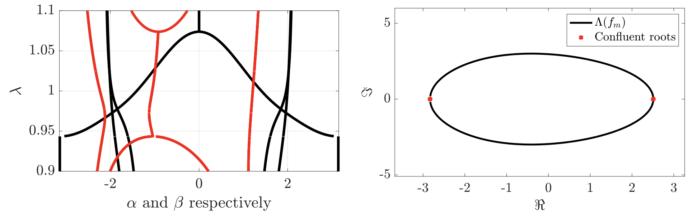

<h1 align="center">Open Limit of <i>m</i>-Banded Toeplitz Operators</h1>

  <b>Y. DE BRUIJN</b> and <b>E. O. HILTUNEN</b> 
  <i>University of Oslo</i> 

  

**Abstract:** We provide the complete computational framework supporting the theoretical results in [1].

  Last updated: December 14, 2025

  
## II.4 Spectrum of Open Limit

This animation illustrates how the open spectrum comprises the intersection of spectra of Toeplitz operators evaluated on the *r*-scaled torus:

$$\lim_{n\to\infty} \sigma\left(\mathbf{T}_n(f_m)\right) = \bigcap_{r>0} \sigma\left(\mathbf{T}\left(f_m(r\mathbb{T})\right)\right) = \left\lbrace \lambda \in \mathbb{C} ~:~ |z_{m}(\lambda)| = |z_{m+1}(\lambda)| \right\rbrace$$

**Collapsed symbol Movie** (`CollapseSymbolMovie.m`)

    <em>Figure 1: Open limitis real valued. Computation performed for m=3, p = 4.5 and q = 6.5.</em> 
 
    <em>Figure 2: Open limit contains complex values. Computation performed for m = 6, p = 1 and q = 6</em> 

## II.5 Reality of the Open Limit

We verify numerically that the open limit produces real-valued spectra providet that $\Lambda(f_m)$ is traced out by a polar curve.

**Set $\Lambda(f)$** (`OpenLimit.m`)

 
   

## II.1 Homotopic transformation of the unit circle

    <em>Figure 1: A Homotopic transfromation from the unit torus to the set L(f), uniformly collapses the spectrum. Computation performed for m=9, p = 3.5 and q = 4.8.</em>

    <em>Figure 1: A simple scaling of the unit torus is not enough to uniformly collapse the symbol function. Computation performed for m=9, p = 3.5 and q = 4.8.</em>

